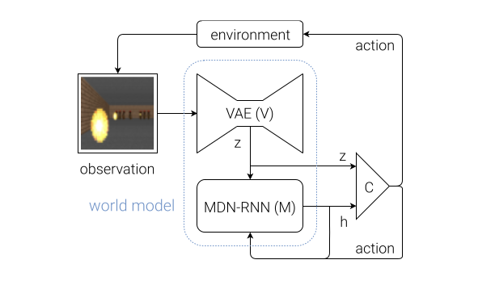

---

````markdown
# Dream To Drive in Latent Space: 

## Project Overview
This project implements a **World Model** for a self-driving car using reinforcement learning and deep learning techniques. The model learns a **latent representation** of the car's environment through a Variational Autoencoder (VAE) and predicts future states using a **Transformer / RNN-based dynamics model**.  

The goal is to simulate and understand the environment efficiently while reducing the need for real-world data collection.

---

## Features
- Collect driving data from **OpenAI Gym CarRacing-v3** environment.
- Train a **Variational Autoencoder (VAE)** to encode high-dimensional images into low-dimensional latent vectors.
- Train a **Transformer / RNN** to predict the next latent state based on the current state and actions.
- Save and visualize reconstructed frames from the VAE.
- Generate sequences of imagined states for planning or reinforcement learning.


Install all dependencies using:

```bash
pip install -r requirements.txt
````
---

## Architecture - Pipeline



**Description:**

1. **Data Collection:** Collect observations, actions, rewards, and done flags from the CarRacing environment.
2. **VAE (V Model):** Encode raw frames into a compact latent vector `z`.
3. **Dynamics Model (M Model):** Predict next latent state `z_{t+1}` given `z_t` and `action_t`.
4. **Imagination / Prediction:** Use latent predictions to simulate future environment states.
5. **Decoder (Optional):** Reconstruct images from predicted latent vectors for visualization.


## References

1. Ha, David & Schmidhuber, Jürgen. (2018). *World Models*. [Paper Link](https://arxiv.org/abs/1803.10122)
2. Hafner, Danijar et al. (2020). *Dreamer: Reinforcement Learning with Latent Dynamics Models*. [Paper Link](https://arxiv.org/abs/1912.01603)
3. OpenAI Gymnasium – CarRacing-v3. [Documentation](https://www.gymlibrary.dev/environments/box2d/carracing/)


```
