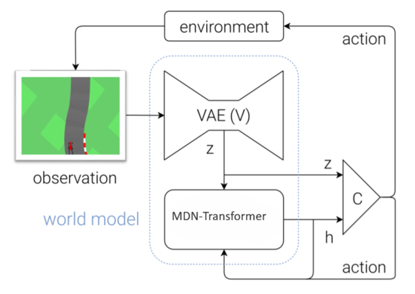

# Transformer Based World Model for Policy Learning

## Introduction

In this project, trained an agent to learn policies using a **Transformer-based World Model architecture**.  
The goal is to build a system that can understand environment dynamics in a latent space and use that understanding to take optimal actions.

Instead of directly learning from raw pixel observations, the model:
- Compresses observations into a latent space
- Learns temporal dynamics using a Transformer-based world model
- Uses this learned representation to train a controller for decision making

This approach improves **sample efficiency**, **generalization**, and provides a way to simulate environments internally.

---

##  World Model Architecture

The architecture consists of three main components:

- **V (Vision Model):** Encodes high-dimensional observations into latent representations  
- **M (Memory Model - Transformer):** Learns temporal dynamics in latent space  
- **C (Controller):** Outputs actions to maximize expected reward  

---

##  Vision Model (V)

The above image shows:
- **Real input image**
- **Reconstructed image after VAE encoding and decoding**

We can observe that the V model is able to:
- Effectively encode state images into a **compact latent space**
- Reconstruct the original image with high fidelity using the decoder

This demonstrates that the latent representation preserves the **important features of the environment**, which is crucial for learning policies.

---

## 🔁 Transformer-Based World Model (M)

The memory model is implemented using a **Transformer architecture**.

Unlike traditional RNN-based approaches, the Transformer:
- Captures long-term dependencies more effectively  
- Uses attention mechanisms to understand temporal relationships  
- Learns structured dynamics in latent space  

This allows the agent to better understand how the environment evolves over time.

---

##  Learning Environment Dynamics

The model is trained such that it predicts the **next state latent representation**.

- This forces the network to learn the **true dynamics of the environment**
- Instead of memorizing, it builds an internal model of transitions

### Predicted Latent States (Decoded for Visualization)

The above figure shows decoded predictions from the model so that we can visually interpret how well it understands environment transitions.

---

## Overall Architecture

This combines:
- Vision model (V)
- Transformer-based memory model (M)
- Controller (C)

Together, they form a complete **world model-based reinforcement learning system**.

---

## 🎮 Controller Training (CMA-ES)

The controller is trained using **CMA-ES (Covariance Matrix Adaptation Evolution Strategy)**.

- It takes latent state + memory context as input  
- Outputs actions that maximize expected reward  
- Works well in continuous control settings  

---

## Generation vs Reward

The graph shows:
- Improvement of reward over generations  
- Efficient learning using latent representations and world modeling  

---

## Final Result (Video) using world model(M) and VAE model(V)

